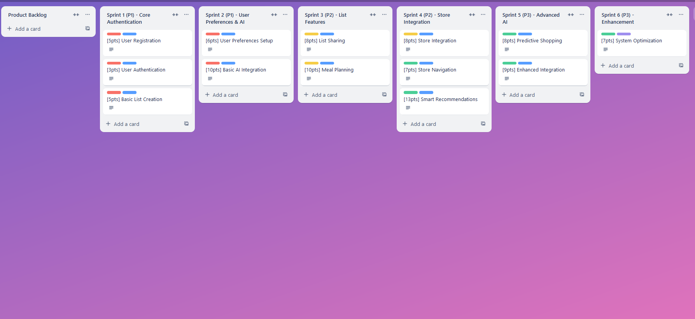

# AI Integrated Grocery List Application - Agile Documentation

## Project Overview
This document outlines the Agile development plan for the AI Integrated Grocery List Application using a hybrid approach.

## Sprint Structure
Total Duration: 12 weeks (6 sprints × 2 weeks)
Total Story Points: 99

### Sprint Breakdown
- Sprint 1 (P1) - Core Authentication: 13 points
- Sprint 2 (P1) - User Preferences & AI: 16 points
- Sprint 3 (P2) - List Features: 18 points
- Sprint 4 (P2) - Store Integration: 15 points
- Sprint 5 (P3) - Advanced AI: 21 points
- Sprint 6 (P3) - Enhancement: 16 points

## Backlog Items Example

## Priority Levels
- P1 (Must Have): Core functionality
- P2 (Should Have): Important but not critical features
- P3 (Could Have): Desired features for future enhancement

## Links
- [Trello Board](https://trello.com/b/vcBn56fl)
- [Detailed Export](./product-backlog.json)
